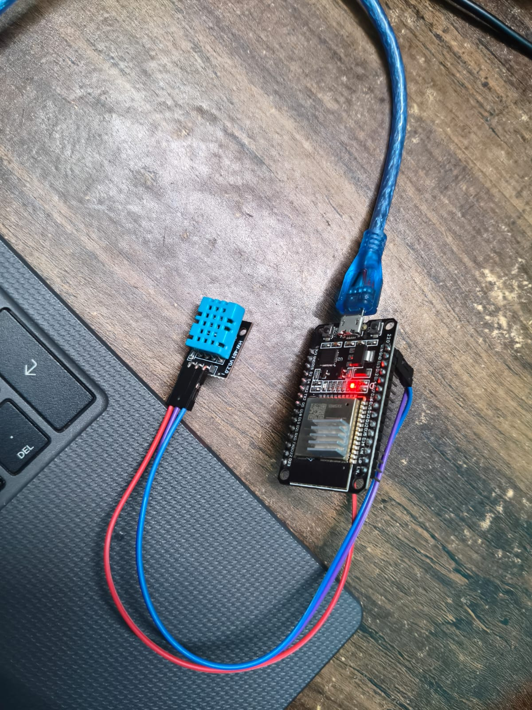
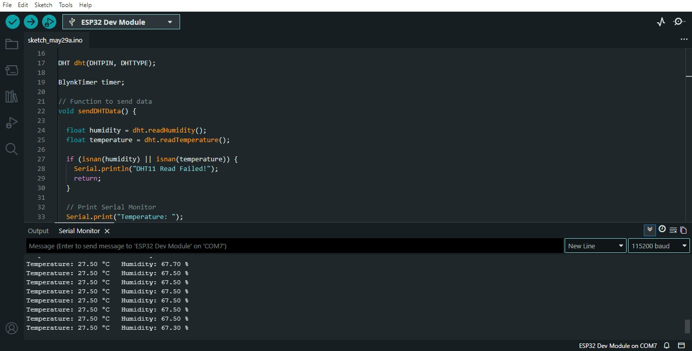
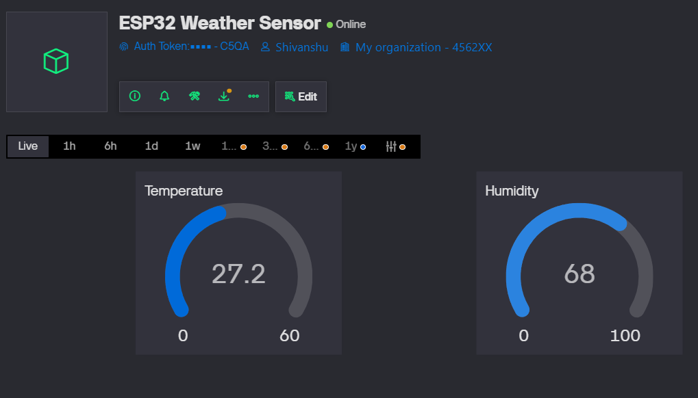

# ESP32 DHT11 Weather Station 🌦️

An **IoT-based weather monitoring system** using **ESP32**, **DHT11 sensor**, and **Blynk Cloud** for real-time **temperature** and **humidity monitoring**.

---

## 📌 Project Overview

This project reads **temperature** and **humidity** data from a **DHT11 sensor** connected to an **ESP32** and sends the data to the **Blynk IoT platform** for live monitoring.

The measured sensor values are displayed in:

* **Arduino Serial Monitor**
* **Blynk Cloud Dashboard**

This project demonstrates **IoT fundamentals, sensor interfacing, ESP32 programming, and cloud monitoring**.

---

## 🚀 Features

✅ Real-time temperature monitoring
✅ Real-time humidity monitoring
✅ Wi-Fi enabled IoT system
✅ Blynk Cloud integration
✅ Live dashboard monitoring
✅ Serial Monitor output for debugging
✅ Automatic sensor updates every 2 seconds

---

## 🛠 Components Used

| Component               | Quantity    |
| ----------------------- | ----------- |
| ESP32 Development Board | 1           |
| DHT11 Sensor            | 1           |
| Breadboard              | 1           |
| Jumper Wires            | As Required |
| USB Cable               | 1           |

---

## ⚙️ Circuit Connections

| DHT11 Pin | ESP32 Pin |
| --------- | --------- |
| VCC       | 3.3V      |
| GND       | GND       |
| DATA      | GPIO 4    |

---

## 🖼 Project Images

### Hardware Setup



### Serial Monitor Output



### Blynk Dashboard



---

## 📊 Working Principle

1. The **DHT11 sensor** measures **temperature** and **humidity**.
2. ESP32 reads the sensor values through **GPIO 4**.
3. Data is printed in the **Arduino Serial Monitor**.
4. ESP32 sends the readings to **Blynk Cloud** using Wi-Fi.
5. Live sensor data is displayed on the **Blynk Dashboard**.

---

## 💻 Software & Libraries Used

### Software

* Arduino IDE
* Blynk IoT Platform

### Libraries

* `WiFi.h`
* `BlynkSimpleEsp32.h`
* `DHT.h`

---

## 📂 Project Files

```text
ESP32-DHT11-Weather-Station/
│── README.md
│── weather_station.ino
│── blynk_dashboard.png
│── hardware_setup.jpeg
│── serial_monitor_output.jpeg
```

---

## 🔧 Setup Instructions

### 1. Clone the Repository

```bash
git clone https://github.com/your-username/ESP32-DHT11-Weather-Station.git
```

### 2. Install Required Libraries

Install the following libraries in **Arduino IDE**:

* Blynk
* DHT Sensor Library
* Adafruit Unified Sensor

### 3. Add Credentials

Replace these placeholders in the code:

```cpp
#define BLYNK_TEMPLATE_ID "YOUR_TEMPLATE_ID"
#define BLYNK_TEMPLATE_NAME "YOUR_TEMPLATE_NAME"
#define BLYNK_AUTH_TOKEN "YOUR_AUTH_TOKEN"

char ssid[] = "YOUR_WIFI_NAME";
char pass[] = "YOUR_WIFI_PASSWORD";
```

### 4. Upload the Code

* Select **ESP32 board**
* Select correct **COM Port**
* Upload the code

### 5. Open Serial Monitor

Set baud rate to:

```text
115200
```

You should see live temperature and humidity values.

---

## 🔮 Future Improvements

* Add OLED/LCD display
* Add historical data logging
* Create a mobile weather dashboard
* Upgrade to DHT22 for better accuracy
* Add weather alerts and notifications

---

## 👨‍💻 Author

**Shivanshu**
Electrical & Electronics Engineering Student

If you found this project useful, feel free to ⭐ the repository.
